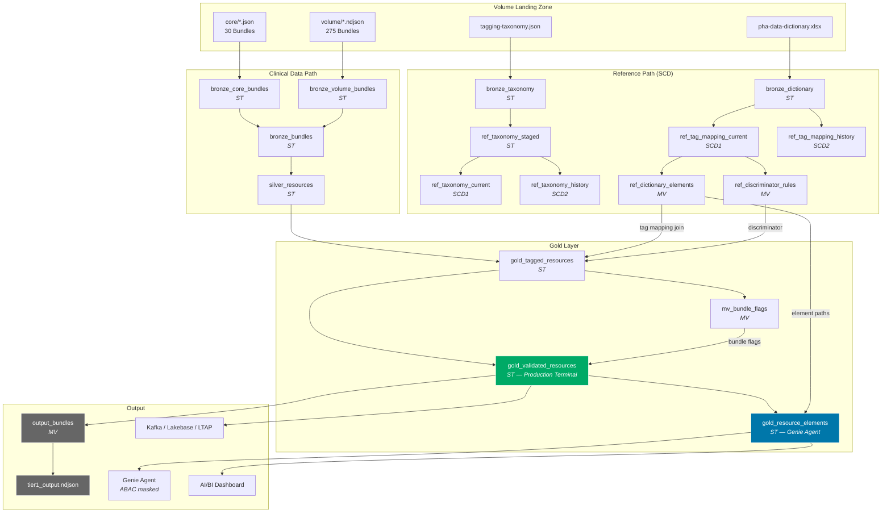
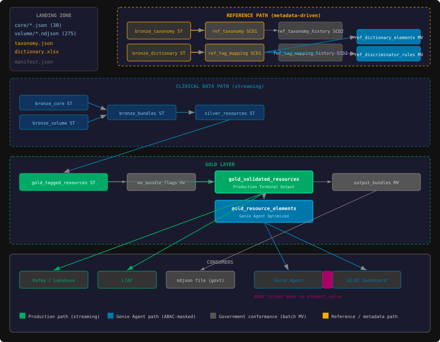

# 01 — Pipeline DAG (End-to-End Data Flow)

> Embed in: L100 Architecture section

```mermaid
flowchart TB
    subgraph LANDING["Volume Landing Zone"]
        CORE["core/*.json<br/>30 Bundles"]
        VOL["volume/*.ndjson<br/>275 Bundles"]
        TAX["tagging-taxonomy.json"]
        DICT["pha-data-dictionary.xlsx"]
    end

    subgraph REFERENCE["Reference Path (SCD)"]
        BT["bronze_taxonomy<br/><i>ST</i>"]
        BD["bronze_dictionary<br/><i>ST</i>"]
        RTS["ref_taxonomy_staged<br/><i>ST</i>"]
        RTC["ref_taxonomy_current<br/><i>SCD1</i>"]
        RTH["ref_taxonomy_history<br/><i>SCD2</i>"]
        RTMC["ref_tag_mapping_current<br/><i>SCD1</i>"]
        RTMH["ref_tag_mapping_history<br/><i>SCD2</i>"]
        RDE["ref_dictionary_elements<br/><i>MV</i>"]
        RDR["ref_discriminator_rules<br/><i>MV</i>"]
    end

    subgraph CLINICAL["Clinical Data Path"]
        BC["bronze_core_bundles<br/><i>ST</i>"]
        BV["bronze_volume_bundles<br/><i>ST</i>"]
        BB["bronze_bundles<br/><i>ST</i>"]
        SR["silver_resources<br/><i>ST</i>"]
    end

    subgraph GOLD["Gold Layer"]
        GTR["gold_tagged_resources<br/><i>ST</i>"]
        MBF["mv_bundle_flags<br/><i>MV</i>"]
        GVR["gold_validated_resources<br/><i>ST — Production Terminal</i>"]
        GRE["gold_resource_elements<br/><i>ST — Genie Agent</i>"]
    end

    subgraph OUTPUT["Output"]
        OB["output_bundles<br/><i>MV</i>"]
        NDJSON["tier1_output.ndjson"]
        KAFKA["Kafka / Lakebase / LTAP"]
        GENIE["Genie Agent<br/><i>ABAC masked</i>"]
        DASH["AI/BI Dashboard"]
    end

    TAX --> BT --> RTS --> RTC & RTH
    DICT --> BD --> RTMC & RTMH
    RTMC --> RDE & RDR

    CORE --> BC --> BB
    VOL --> BV --> BB
    BB --> SR

    SR --> GTR
    RDE -->|"tag mapping join"| GTR
    RDR -->|"discriminator"| GTR

    GTR --> MBF
    GTR --> GVR
    MBF -->|"bundle flags"| GVR

    GVR --> GRE
    RDE -->|"element paths"| GRE
    GVR --> OB --> NDJSON
    GVR --> KAFKA
    GRE --> GENIE
    GRE --> DASH

    style GVR fill:#0a6,stroke:#fff,color:#fff
    style GRE fill:#07a,stroke:#fff,color:#fff
    style OB fill:#666,stroke:#fff,color:#fff
    style NDJSON fill:#666,stroke:#fff,color:#fff
```

