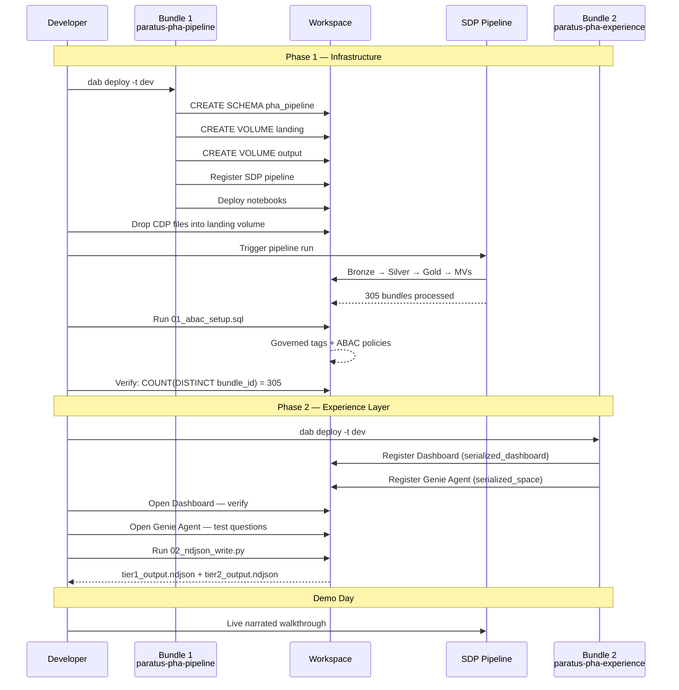
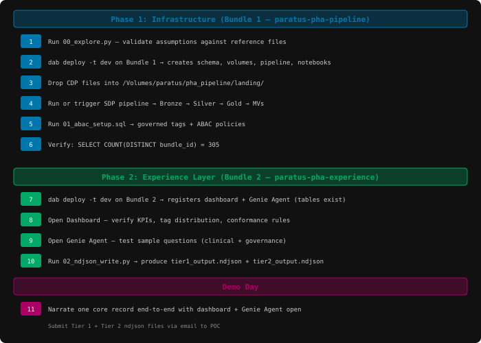

# 02 — Two-Bundle Deployment Sequence

> Embed in: L100 DAB Bundle Structure, L300 Execution Order

```mermaid
sequenceDiagram
    participant Dev as Developer
    participant B1 as Bundle 1<br/>paratus-pha-pipeline
    participant WS as Workspace
    participant Pipeline as SDP Pipeline
    participant B2 as Bundle 2<br/>paratus-pha-experience

    Note over Dev,B2: Phase 1 — Infrastructure

    Dev->>B1: dab deploy -t dev
    B1->>WS: CREATE SCHEMA pha_pipeline
    B1->>WS: CREATE VOLUME landing
    B1->>WS: CREATE VOLUME output
    B1->>WS: Register SDP pipeline
    B1->>WS: Deploy notebooks

    Dev->>WS: Drop CDP files into landing volume
    Dev->>Pipeline: Trigger pipeline run
    Pipeline->>WS: Bronze → Silver → Gold → MVs
    Pipeline-->>WS: 305 bundles processed

    Dev->>WS: Run 01_abac_setup.sql
    WS-->>WS: Governed tags + ABAC policies

    Dev->>WS: Verify: COUNT(DISTINCT bundle_id) = 305

    Note over Dev,B2: Phase 2 — Experience Layer

    Dev->>B2: dab deploy -t dev
    B2->>WS: Register Dashboard (serialized_dashboard)
    B2->>WS: Register Genie Agent (serialized_space)

    Dev->>WS: Open Dashboard — verify
    Dev->>WS: Open Genie Agent — test questions
    Dev->>WS: Run 02_ndjson_write.py
    WS-->>Dev: tier1_output.ndjson + tier2_output.ndjson

    Note over Dev,B2: Demo Day
    Dev->>Pipeline: Live narrated walkthrough
```

