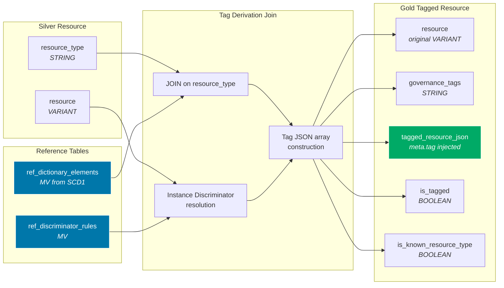
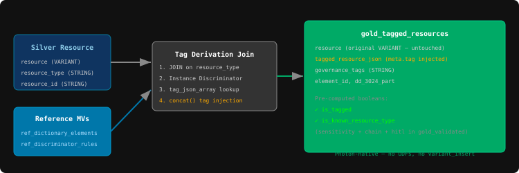

# 03 — Tag Derivation Flow (Silver → Gold)

> Embed in: L200-D Tag Derivation Engine

```mermaid
flowchart LR
    subgraph INPUT["Silver Resource"]
        RES["resource<br/><i>VARIANT</i>"]
        RT["resource_type<br/><i>STRING</i>"]
    end

    subgraph REF["Reference Tables"]
        TM["ref_dictionary_elements<br/><i>MV from SCD1</i>"]
        DR["ref_discriminator_rules<br/><i>MV</i>"]
    end

    subgraph JOIN["Tag Derivation Join"]
        J1["JOIN on resource_type"]
        J2["Instance Discriminator<br/>resolution"]
        J3["Tag JSON array<br/>construction"]
    end

    subgraph GOLD_OUT["Gold Tagged Resource"]
        ORIG["resource<br/><i>original VARIANT</i>"]
        TAGS["governance_tags<br/><i>STRING</i>"]
        JSON["tagged_resource_json<br/><i>meta.tag injected</i>"]
        B1["is_tagged<br/><i>BOOLEAN</i>"]
        B2["is_known_resource_type<br/><i>BOOLEAN</i>"]
    end

    RT --> J1
    TM --> J1
    RES --> J2
    DR --> J2
    J1 --> J3
    J2 --> J3

    J3 --> ORIG
    J3 --> TAGS
    J3 --> JSON
    J3 --> B1
    J3 --> B2

    style TM fill:#07a,stroke:#fff,color:#fff
    style DR fill:#07a,stroke:#fff,color:#fff
    style JSON fill:#0a6,stroke:#fff,color:#fff
```

