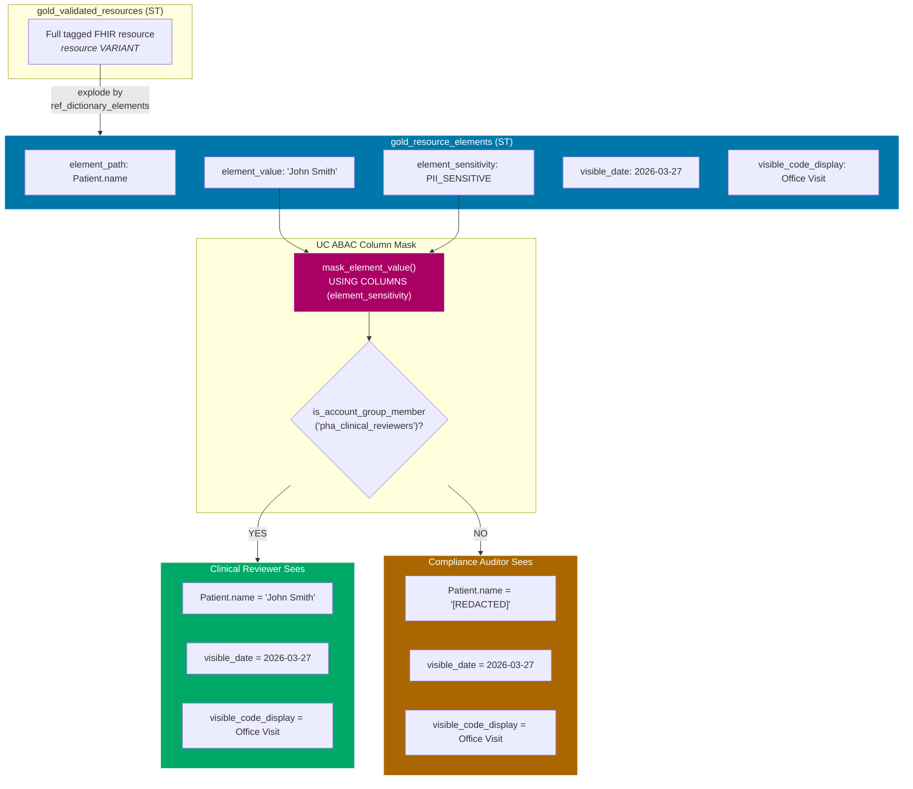
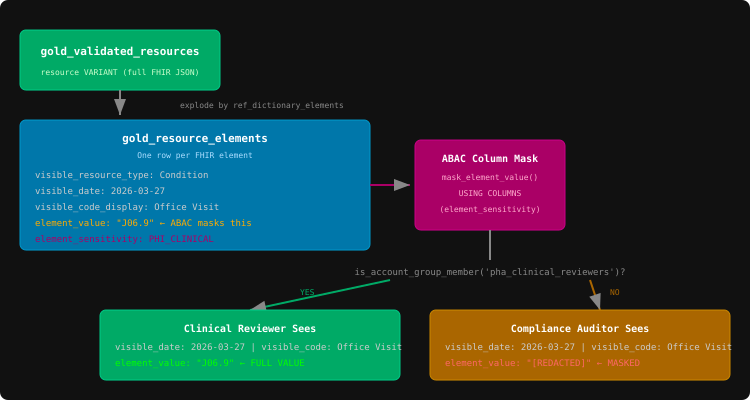

# 04 — ABAC Field-Level Redaction Model

> Embed in: L200-E Element-Level Gold, L200-I ABAC Setup

```mermaid
flowchart TB
    subgraph GOLD["gold_validated_resources (ST)"]
        GR["Full tagged FHIR resource<br/><i>resource VARIANT</i>"]
    end

    subgraph ELEMENTS["gold_resource_elements (ST)"]
        direction TB
        E1["element_path: Patient.name"]
        E2["element_value: 'John Smith'"]
        E3["element_sensitivity: PII_SENSITIVE"]
        E4["visible_date: 2026-03-27"]
        E5["visible_code_display: Office Visit"]
    end

    subgraph ABAC["UC ABAC Column Mask"]
        MASK["mask_element_value()<br/>USING COLUMNS (element_sensitivity)"]
        GROUP{"is_account_group_member<br/>('pha_clinical_reviewers')?"}
    end

    subgraph CLINICAL["Clinical Reviewer Sees"]
        C1["Patient.name = 'John Smith'"]
        C2["visible_date = 2026-03-27"]
        C3["visible_code_display = Office Visit"]
    end

    subgraph AUDITOR["Compliance Auditor Sees"]
        A1["Patient.name = '[REDACTED]'"]
        A2["visible_date = 2026-03-27"]
        A3["visible_code_display = Office Visit"]
    end

    GR -->|"explode by<br/>ref_dictionary_elements"| ELEMENTS
    E2 --> MASK
    E3 --> MASK
    MASK --> GROUP
    GROUP -->|"YES"| CLINICAL
    GROUP -->|"NO"| AUDITOR

    style ELEMENTS fill:#07a,stroke:#fff,color:#fff
    style MASK fill:#a06,stroke:#fff,color:#fff
    style CLINICAL fill:#0a6,stroke:#fff,color:#fff
    style AUDITOR fill:#a60,stroke:#fff,color:#fff
```

