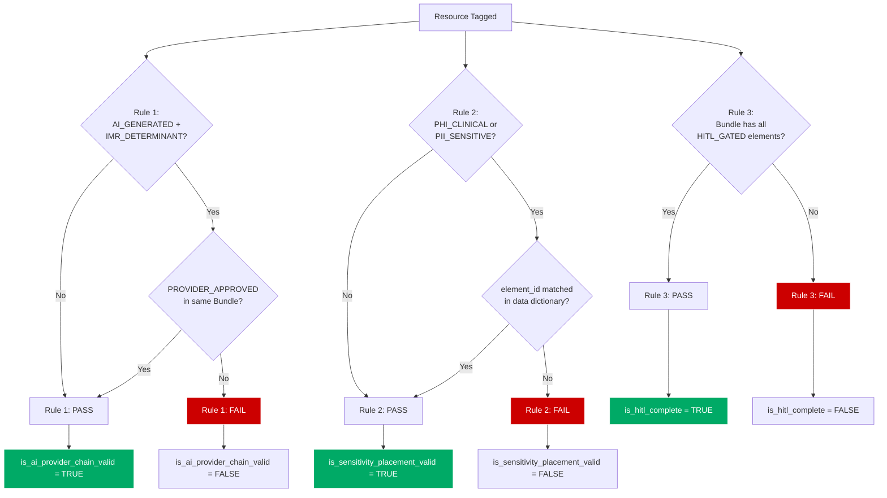
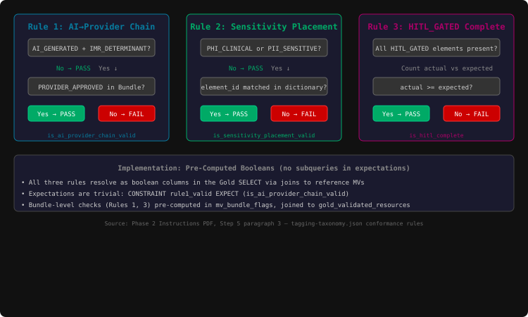

# 06 — Conformance Rules Decision Tree

> Embed in: L200-D Tag Derivation Engine, L200-L Conformance Validation

```mermaid
flowchart TB
    START["Resource Tagged"] --> R1{"Rule 1:<br/>AI_GENERATED +<br/>IMR_DETERMINANT?"}

    R1 -->|"No"| R1_PASS["Rule 1: PASS"]
    R1 -->|"Yes"| R1_CHECK{"PROVIDER_APPROVED<br/>in same Bundle?"}
    R1_CHECK -->|"Yes"| R1_PASS
    R1_CHECK -->|"No"| R1_FAIL["Rule 1: FAIL"]

    START --> R2{"Rule 2:<br/>PHI_CLINICAL or<br/>PII_SENSITIVE?"}
    R2 -->|"No"| R2_PASS["Rule 2: PASS"]
    R2 -->|"Yes"| R2_CHECK{"element_id matched<br/>in data dictionary?"}
    R2_CHECK -->|"Yes"| R2_PASS
    R2_CHECK -->|"No"| R2_FAIL["Rule 2: FAIL"]

    START --> R3{"Rule 3:<br/>Bundle has all<br/>HITL_GATED elements?"}
    R3 -->|"Yes"| R3_PASS["Rule 3: PASS"]
    R3 -->|"No"| R3_FAIL["Rule 3: FAIL"]

    R1_PASS --> CONFORM["is_ai_provider_chain_valid = TRUE"]
    R1_FAIL --> NONCONFORM1["is_ai_provider_chain_valid = FALSE"]
    R2_PASS --> CONFORM2["is_sensitivity_placement_valid = TRUE"]
    R2_FAIL --> NONCONFORM2["is_sensitivity_placement_valid = FALSE"]
    R3_PASS --> CONFORM3["is_hitl_complete = TRUE"]
    R3_FAIL --> NONCONFORM3["is_hitl_complete = FALSE"]

    style R1_FAIL fill:#c00,stroke:#fff,color:#fff
    style R2_FAIL fill:#c00,stroke:#fff,color:#fff
    style R3_FAIL fill:#c00,stroke:#fff,color:#fff
    style CONFORM fill:#0a6,stroke:#fff,color:#fff
    style CONFORM2 fill:#0a6,stroke:#fff,color:#fff
    style CONFORM3 fill:#0a6,stroke:#fff,color:#fff
```

