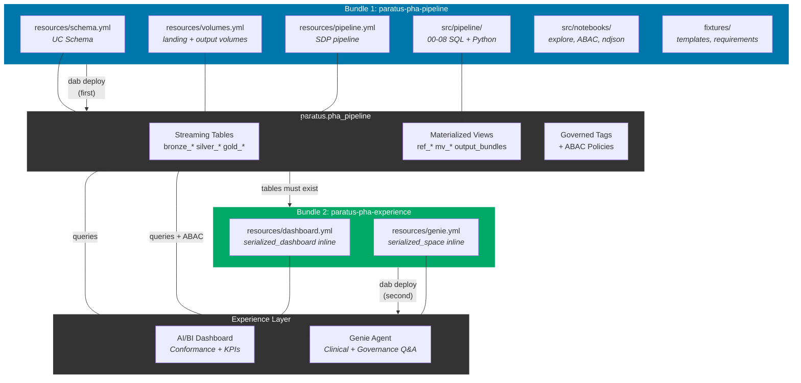
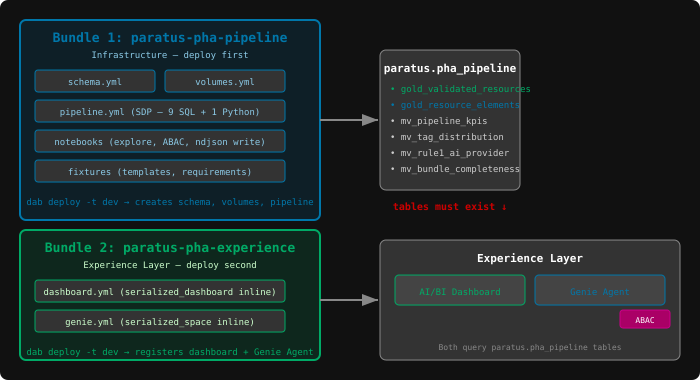

# 07 — Two-Bundle DAB Architecture

> Embed in: L100 DAB Bundle Structure

```mermaid
flowchart TB
    subgraph B1["Bundle 1: paratus-pha-pipeline"]
        direction TB
        B1_SCHEMA["resources/schema.yml<br/><i>UC Schema</i>"]
        B1_VOL["resources/volumes.yml<br/><i>landing + output volumes</i>"]
        B1_PIPE["resources/pipeline.yml<br/><i>SDP pipeline</i>"]
        B1_SQL["src/pipeline/<br/><i>00-08 SQL + Python</i>"]
        B1_NB["src/notebooks/<br/><i>explore, ABAC, ndjson</i>"]
        B1_FIX["fixtures/<br/><i>templates, requirements</i>"]
    end

    subgraph SCHEMA["paratus.pha_pipeline"]
        direction TB
        TABLES["Streaming Tables<br/>bronze_* silver_* gold_*"]
        MVS["Materialized Views<br/>ref_* mv_* output_bundles"]
        ABAC_TAG["Governed Tags<br/>+ ABAC Policies"]
    end

    subgraph B2["Bundle 2: paratus-pha-experience"]
        direction TB
        B2_DASH["resources/dashboard.yml<br/><i>serialized_dashboard inline</i>"]
        B2_GENIE["resources/genie.yml<br/><i>serialized_space inline</i>"]
    end

    subgraph EXPERIENCE["Experience Layer"]
        DASHBOARD["AI/BI Dashboard<br/><i>Conformance + KPIs</i>"]
        AGENT["Genie Agent<br/><i>Clinical + Governance Q&A</i>"]
    end

    B1 -->|"dab deploy<br/>(first)"| SCHEMA
    B1_SCHEMA --> TABLES
    B1_VOL --> TABLES
    B1_PIPE --> TABLES
    B1_SQL --> MVS

    SCHEMA -->|"tables must exist"| B2
    B2 -->|"dab deploy<br/>(second)"| EXPERIENCE
    B2_DASH --> DASHBOARD
    B2_GENIE --> AGENT

    TABLES -->|"queries"| DASHBOARD
    TABLES -->|"queries + ABAC"| AGENT

    style B1 fill:#07a,stroke:#fff,color:#fff
    style B2 fill:#0a6,stroke:#fff,color:#fff
    style SCHEMA fill:#333,stroke:#fff,color:#fff
    style EXPERIENCE fill:#333,stroke:#fff,color:#fff
```

