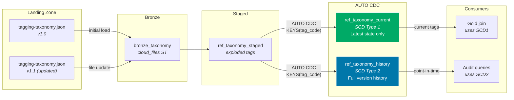
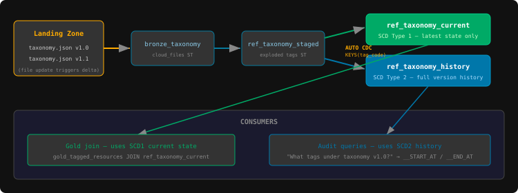

# 08 — SCD1 + SCD2 Reference Data Flow

> Embed in: L200-A Reference File Ingestion

```mermaid
flowchart LR
    subgraph SOURCE["Landing Zone"]
        V1["tagging-taxonomy.json<br/><i>v1.0</i>"]
        V2["tagging-taxonomy.json<br/><i>v1.1 (updated)</i>"]
    end

    subgraph BRONZE["Bronze"]
        BT["bronze_taxonomy<br/><i>cloud_files ST</i>"]
    end

    subgraph STAGED["Staged"]
        RTS["ref_taxonomy_staged<br/><i>exploded tags</i>"]
    end

    subgraph SCD["AUTO CDC"]
        SCD1["ref_taxonomy_current<br/><i>SCD Type 1</i><br/>Latest state only"]
        SCD2["ref_taxonomy_history<br/><i>SCD Type 2</i><br/>Full version history"]
    end

    subgraph CONSUMERS["Consumers"]
        GOLD["Gold join<br/><i>uses SCD1</i>"]
        AUDIT["Audit queries<br/><i>uses SCD2</i>"]
    end

    V1 -->|"initial load"| BT
    V2 -->|"file update"| BT
    BT --> RTS
    RTS -->|"AUTO CDC<br/>KEYS(tag_code)"| SCD1
    RTS -->|"AUTO CDC<br/>KEYS(tag_code)"| SCD2

    SCD1 -->|"current tags"| GOLD
    SCD2 -->|"point-in-time"| AUDIT

    style SCD1 fill:#0a6,stroke:#fff,color:#fff
    style SCD2 fill:#07a,stroke:#fff,color:#fff
```

